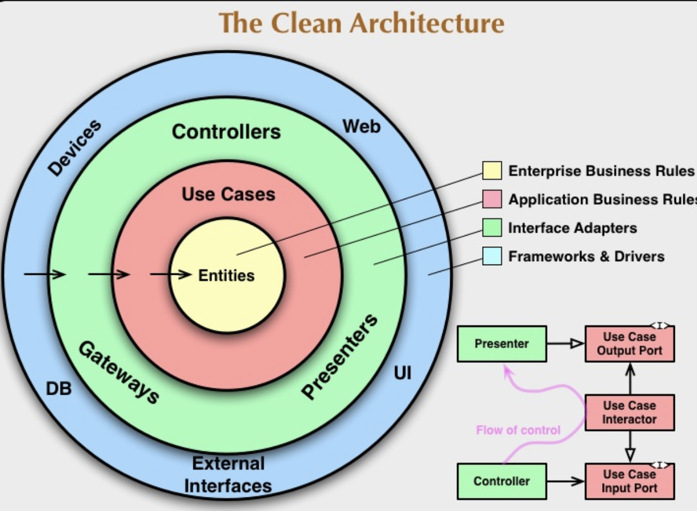

# NodeJS Clean Architecture Example

A NodeJs Project to showcase how to use Clean Architecture

## Libraries Used
    - ExpressJS
    - Mongoose
    - DotEnv

## How to Setup
```bash
    cd nodejs-clean-architecture
    npm install
    node -r dotenv/config index.js 
```

## What is Clean Architecture

Clean architecture is a software design philosophy that separates elements of design into ring levels. The purpose of clean architecture is to have a separation of concerns.

    1. Frameworks/Drivers
    2. Interface Adapters
    3. Use-case
    4. Entities



### Dependency Rule

    The dependency rule says that the source code should only point inwards. It means that in the inner circles, it can't know anything about the outside circles. In particular, dependencies should be coming from the top to bottom and not the other way around. For example Database -> Business rules -> Enterprise rule. In this way even if we change the database the business rules and enterprise rules should still be valid.

### Frameworks/Drivers

    This is where you will put your chosen frameworks/drivers. This is where you will put your external dependencies such as Database, Frameworks, etc

### Interface Adapters

    In this layer, This is where you will put your controllers, presenters, and gateways. Think of it as the ingress/egress of the application.

### Use-case

    Use-case is the place where you will put your application business rules.

### Entities

    Entities is the place you will put your Enterprise Business rules. A good example would be an application's business Object in this project it's the Todo object. Entities are not limited to objects they could be also a set of data structures or functions.